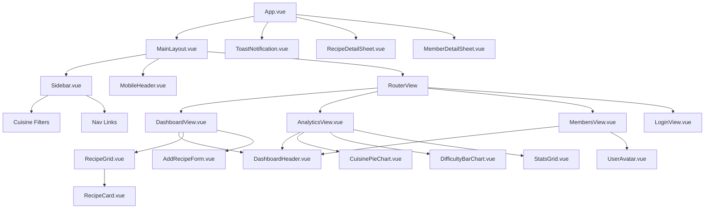

# Culinara OS - Project Report
**Author**: Ilmam I.M. (EG/2023/5646)
**Date**: May 4, 2026

## 1. List of Features Implemented

Culinara OS is a comprehensive recipe management system that integrates AI and live data to provide a premium user experience. Key features include:

*   **🤖 AI Culinary Insights**: Integration with Google Gemini 3 Pro to generate smart summaries and tags for recipes.
*   **📊 Kitchen Analytics Dashboard**: Dynamic data visualization using Chart.js, showcasing cuisine distribution and recipe difficulty levels.
*   **📡 Live Data Integration**: Consumption of the DummyJSON Recipes API for real-world culinary data.
*   **🔍 Global Search & Filtering**: Real-time search across names, ingredients, and cuisines with persistent sidebar filters.
*   **💾 State-of-the-Art Persistence**: Pinia-based state management synchronized with LocalStorage for session continuity.
*   **✨ Premium Design System**: A custom "Slate & Emerald" theme with glassmorphism effects, smooth slide-over panels, and responsive layouts.
*   **👤 Chef Profiles**: User authentication and profile management, including favorite recipe tracking and profile picture persistence.

## 2. Component Hierarchy & Architecture

The application follows an Atomic Design philosophy, structured for maximum reusability and clean state flow.

### Architectural Diagram

### Architectural Explanation

*   **Global Overlays**: `RecipeDetailSheet` and `MemberDetailSheet` are mounted at the root (`App.vue`) to allow them to be triggered from any view while maintaining a consistent slide-over animation.
*   **Layout Wrapper**: `MainLayout` provides the structural shell, managing the responsive Sidebar and Content areas.
*   **State Management**: Pinia stores (`recipeStore`, `authStore`, `uiStore`) act as the "Single Source of Truth," decoupling data logic from visual components.
*   **Composables**: Logic for storage (`useStorage`), AI (`aiService`), and recipes (`useRecipes`) is encapsulated in composables for clean code separation.
