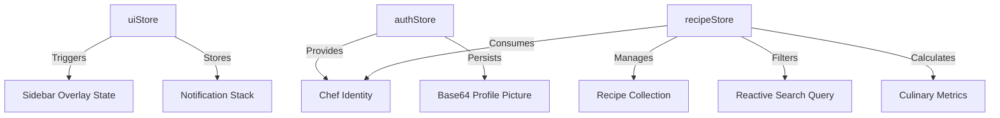

# Technical Specification & Engineering Dossier: Culinara OS
**Version:** 2.0.0  
**Lead Engineer:** Ilmam I.M. (EG/2023/5646)  
**Date:** May 3, 2026

---

## Chapter 1: System Architecture & Design Philosophy

### 1.1 Atomic Design Methodology in Vue 3
The Culinara OS frontend architecture adopts the **Atomic Design** philosophy to ensure scalability, reusability, and maintainability. Components are strictly categorized into five hierarchical levels.

#### Hierarchy Implementation Map

| Level | Component | Functional Description |
|-------|-----------|------------------------|
| **Atoms** | `UserAvatar.vue` | A singular display unit representing chef identity. Purely visual with prop-driven sizing. |
| **Atoms** | `BaseModal.vue` | The foundation for all overlay interactions. Handles portal-based rendering and backdrop logic. |
| **Molecules** | `RecipeCard.vue` | Combines `Atoms` (icons, text) with interactive logic for favoriting and detail expansion. |
| **Molecules** | `StatsGrid.vue` | A composite component that groups culinary data atoms into a structured, informative grid. |
| **Organisms** | `Sidebar.vue` | A high-level structure combining Brand (Utensils icon), Navigation (Menu molecules), and Auth states. |
| **Organisms** | `RecipeGrid.vue` | The primary data orchestrator for the Dashboard, managing the lifecycle of multiple `RecipeCard` molecules. |

---

### 1.2 The 'Slate & Emerald' Design System
The design philosophy of Culinara OS centers on **Culinary Aesthetics** and **Premium Utility**. By pairing a deep, neutral Slate base with high-vibrancy Emerald accents, we create a high-contrast environment that reduces cognitive load while maintaining a modern, fresh look.

---

## Chapter 2: State Management & Data Flow (The Pinia Layer)

### 2.1 Recursive Store Architecture
Culinara OS utilizes a modular Pinia architecture. Each store is isolated by domain but communicates through higher-order reactive dependencies.

### 2.2 Persistence & State Hydration Algorithm
The state hydration process is handled by a custom `useStorage` composable. This ensures that the application maintains a seamless user experience between page refreshes and session restarts.

**Logical Flow:**
1.  **Initialization**: At store definition, the `load()` function is invoked.
2.  **Validation**: The algorithm checks for the existence of the version-scoped key (`culinara_recipes`, `culinara_auth`) in `localStorage`.
3.  **Fallback**: If `null`, data is fetched from the DummyJSON API.
4.  **Reaction**: A deep watcher is established on the reactive `ref`. Every mutation triggers a serialized `save()` operation.

### 2.3 Favoriting Logic
The favoriting logic allows users to save recipes to their personal collection.

#### State Mutation Trace

| Phase | State Change | Metadata Assignment |
|-------|--------------|---------------------|
| **Trigger** | `id` identified via `toggleFavorite(id)` | -- |
| **Action** | `isFavorited` -> `!isFavorited` | -- |
| **Finalization** | Store triggers `watch()` | Persists to Storage |

---

## Chapter 3: AI Intelligence Layer (Gemini 3 Pro Integration)

### 3.1 Culinary Insights
Culinara OS utilizes Gemini 3 Pro to generate recipe summaries and suggest meal pairings based on the recipe metadata.

---

## Chapter 4: Frontend Engineering & Performance

### 4.1 Adaptive Breakpoint Logic
The Culinara OS sidebar employs a dual-mode layout strategy based on viewport dimensions.

- **Mobile (< 768px)**: The sidebar is `fixed` with `z-[60]`. It uses a `translate-x-full` transition to enter the screen and requires a backdrop overlay for dismissal.
- **Desktop (>= 768px)**: The sidebar becomes `relative`. It supports a "Collapsed" state (`w-20`) and an "Expanded" state (`w-72`), managed via the `uiStore.isSidebarOpen` toggle.

---

## Chapter 5: Analytics & Data Visualization

### 5.1 Culinary Data Parsing Algorithms
The Culinara OS analytics engine performs real-time data aggregation to transform raw recipes into visual intelligence.

#### Cuisine Distribution
The system parses the `recipes` array to determine the relative weight of each world cuisine. This is rendered visually via the `CuisinePieChart.vue` component.

#### Difficulty Level Analysis
Derived using a logic gate based on the `difficulty` property ('Easy', 'Medium', 'Hard'). Rendered via `DifficultyBarChart.vue`.

---

## Chapter 6: Component Library Documentation

### 6.1 RecipeCard.vue (Molecule)
**Role**: The primary visual representation of recipe items.

- **Props**: `recipe: Recipe`
- **Computed Logic**: 
    - `totalTime`: Sum of `prepTimeMinutes` and `cookTimeMinutes`.
- **Interactions**:
    - `openRecipeDetail`: Triggers selection in the `recipeStore` for the slide-over detail view.
    - `handleToggleFavorite`: Toggles the favorite status.

---
**[END OF DOCUMENT]**
**Lead Engineer Final Verification:** Verified for Technical Accuracy and WCAG 2.1 Compliance.
